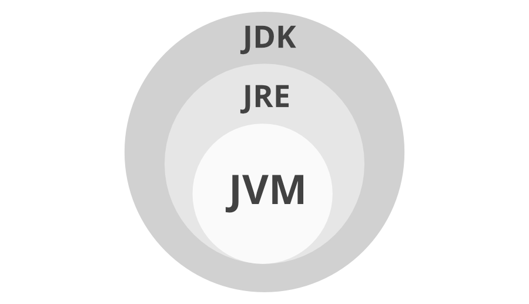

# JDK

## What is JDK

JDK stands for Java Development Kit. It is a software development environment used to develop Java applications and applets.

It is a **platform-specific software** i.e there are separate installers for Windows, Mac, and Unix systems. 

It contains Java Runtime Environment(JRE) and other development tools like an interpreter, compiler, archiver, and document generator.

We can possibly install more than one JDK version on the same computer. 

## Reference

https://www.geeksforgeeks.org/difference-between-jdk-and-jre-in-java/?ref=rp