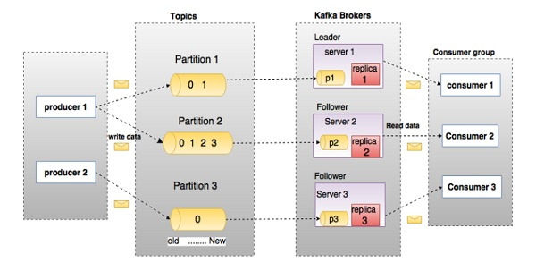

# Apache Kafka

## Overview

### Kafka

Kafka is designed for distributed high throughput systems.

Kafka has **better throughput**, **built-in partitioning**, **replication** and **inherent fault-tolerance**, which makes it a good fit for large-scale message processing applications.

### Message System

A Messaging System is responsible for **transferring data from one application to another**, so the applications can focus on data, but not worry about how to share it.

Distributed messaging is based on the concept of **reliable** **message queuing**. Messages are queued asynchoronously between client applications and messaging system.

### Point to Point Messaging System

In a point-to-point system, **messages are persisted in a queue**. 

One or more consumers can consume the messages in the queue, but **a particular message can be consumed by a maximum of one consumer only**. 

*Once a consumer reads a message in the queue, it disappears from that queue.*

Thy typical example of this system is an Ordering Processing System, where each order will be processed by one Order Processor, but Muliple Order Processors can work as well at the same time.

### Publish-Subscribe Messaging System

In the publish-subscribe system, messages are persisted in a topic.

Consumers can subscribe to one or more topic and consume all the message in that topic.

Message producers are called publisher and message consumers are called subscribers.

### What is Kafka?

**Apache Kafka is a distributed publish-subscribe messging system.**

Kafka is suitable for both offline and online message consumption.

Kafka messages are **persisted on the disk** and replicated within the **cluster** to prevent data loss.

Kafka is built on top of the **ZooKeeper** synchronization service.

It integrates very well with **Apache Storm and Spark** for real-time streaming data analysis.

**Kafka is very fast and guarantees zero downtime and zero data loss.**

#### Use Cases

- Metrics
- Log Aggregation Solution
- Stream Processing

## Main terminologies

| Components            | Description                                                  |
| --------------------- | ------------------------------------------------------------ |
| Topics                | A stream of messages belonging to a particular category is called a topic. Data is stored in topics. Topics are split to partitions. Each topic keeps a minimum of one partition. |
| Partition             | Topics may have many partitions. Partition can handle an arbitrary amount of data. Each such partition contains messages in an immutable ordered sequence. A partition is implemented as a set of segment files of equal size. |
| Partition offset      | Each partitioned message has a unique sequence id called as "offset" |
| Replicas of partition | Replicas are noting but "backups" of a partition. Replicas are never read or write data. They are used to prevent data loss. |
| Brokers               | Brokers are simple system responsible for maintaining the published data. Each broker may have zero or more partitions per topic. |
| Kafka Cluster         | Kafka's having more than one broker are called as Kafka cluster. A kafka cluster can be expanded without downtime. These clusters are used to manage the persistence and replication of message data. |
| Producers             | Producers are the publisher of messages to one or more Kafka topics. Producers send data to Kafka brokers. |
| Consumers             | Consumers read data from brokers.                            |
| Leader                | "Leader" is the node responsible for all reads and writes for the given partition. Every partition has one server acting as a leader. |
| Follower              | Node which follows leader instructions are called as follower. If the leader fails, one of the follower will automatically become the new leader. |

## Cluster Architecture

| Components | Description                                                  |
| ---------- | ------------------------------------------------------------ |
| Broker     | Kafka cluster typically consists of multiple brokers to maintain load balance. Kafka brokers are stateless, so they use ZooKeeper for maintaining theire cluster state. Kafka broker leader election can be done by ZooKeeper. |
| ZooKeeper  | ZooKeeper is used for managing and coordinating Kafka broker. |

## Workflow

## Reference

[Kafka Github Page](https://github.com/apache/kafka)

[Kakfa Homepage](https://kafka.apache.org/)

[Kafka Tutorail in tutorialspoint](tutorialspoint)