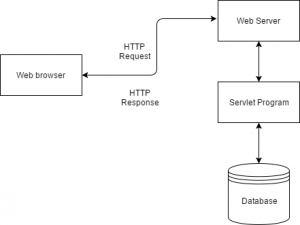

# Servlet

## Overview

A **servlet** is a Java programming language class that is used to extend the capabilities of servers that host applications accessed by means of a request-response programming model.

*Servlets are the Java programs that run on the Java-enabled web server or application server.*

**Java Servlet** is also one of the component APIs of **Java Platform Enterprise Edition** which sets standards for creating dynamic Web applications in Java. 

They are used to handle the request obtained from the webserver, process the request, produce the response, then send a response back to the webserver. 

The Servlet technology is similar to other Web server extensions such as **Common Gateway Interface**(CGI) scripts and **Hypertext Preprocessor** (PHP).

 

**Servlets API’s:** 
Servlets are build from two packages: 

- javax.servlet(Basic)
- javax.servlet.http(Advance)

# Servlet Container

**Servlet container**, also known as **Servlet engine** is an integrated set of objects that provide a run time environment for Java Servlet components. 

In simple words, it is a system that **manages Java Servlet components on top of the Web server** to handle the Web client requests. 

**Services provided by the Servlet container**:

- Network Service
- Decode and Encode MINE-based messages
- Manage Servlet container
- Resource management
- Security Service
- Session Management