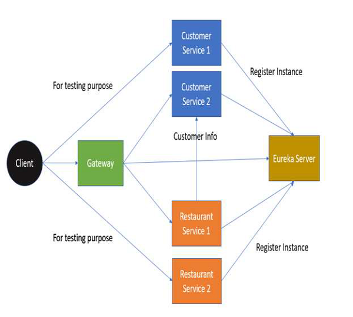

# Spring Cloud

## Overview

Spring Cloud is a collection of ready-to-use components which are useful in building distributed applications in an enterprise.

Main components provided by Spring Cloud:

- Distributed Messaging
- Load balancing
- Service Registration
- Circuit breakers
- Routing
- Distributed Logging
- Centralized Configuration

| Problem                         | Components                                                   |
| ------------------------------- | ------------------------------------------------------------ |
| Distributed Cloud Configuration | Spring Cloud Configuration, Spring Cloud Zookeeper, Spring Consul Config |
| Distrubuted Messaging           | Spring Stream with Kafka, Spring Stream with RabbitMQ        |
| Service Discovery               | Spring Cloud Eureka, Spring Cloud Consul, Spring Cloud Zookeeper |
| Logging                         | Spring Cloud Zipkin, Spring Cloud Sleuth                     |
| Spring Service Communication    | Spring Hystrix, Spring Ribbon, Spring Feign, Spring Zuul     |

## Dependency Management

### Core Dependency

```xml
<dependencyManagement>
   <dependencies>
      <dependency>
         <groupId>org.springframework.cloud</groupId>
         <artifactId>spring-cloud-dependencies</artifactId>
         <version>Hoxton.SR8</version>
         <type>pom</type>
         <scope>import</scope>
      </dependency>
   </dependencies>
</dependencyManagement>
```

### Project Architecture and Structure



## Service Discovery Using Eureka

Service Discovery helps tracking the service address and the ports where the service instances can be contact to. There are three components at play here:

- **Service Instances** - Responsible to handle incoming request for the service and respond to those requests.
- **Service Registry** - Keeps track of the addresses of the service instances. 
- **Service Client** - The client which wants access or wants to place a request and get respnose from the service instances. *The service client contacts the service registry to get the address of the instances.*

**Apache Zookeeper, Eureka and Consul** are a few well-known components which are used for Service Discovery.

### Eureka Server/Registry

#### Add eureka dependency to Maven

```xml
<dependency>
      <groupId>org.springframework.cloud</groupId>
      <artifactId>spring-cloud-starter-netflix-eureka-server</artifactId>
   </dependency>
```

#### Add `@EnableEurekaServer` annotation to Application Entry point

#### Change application.properties

```properties
server.port = 8900
eureka.client.register-with-eureka = false
eureka.client.fetch-registry = false
```

```yml
server:
   port: 8900
eureka:
   client:
      register-with-eureka: false
      fetch-registry: false
```

### Setting up Eureka Client for Instance

#### Add dependency to POM.xml

```xml
<dependencies>
   <dependency>
      <groupId>org.springframework.cloud</groupId>
      <artifactId>spring-cloud-starter-netflix-eureka-client</artifactId>
   </dependency>
   <dependency>
      <groupId>org.springframework.boot</groupId>
      <artifactId>spring-boot-starter-web</artifactId>
   </dependency>
</dependencies>
```

#### Add annotation to Spring Application class

```java
@SpringBootApplication
@EnableDiscoveryClient
public class DemoApplication {}
```

#### Change application properties

```properties
spring.application.name = customer-service
server.port = ${app_port}
eureka.client.serviceURL.defaultZone = http://localhost:8900/eureka
```

```yml
spring:
   application:
      name: customer-service
server:
   port: ${app_port}
eureka:
   client:
      service-url:
         defaultZone: http://localhost:8900/eureka
```

#### Startup Client

- Generate .jar file: `mvn package -Dmaven.test.skip`
- Startup project: `java -Dapp_port=8081 -jar xxx.jar`

### Eureka - High Availability

- Add a `application-ha.yaml` to start Eureka Server
    ```yaml
    spring:
       application:
          name: eureka-server
    server:
       port: ${app_port}
    eureka:
       client:
          service-url:
             defaultZone: ${eureka_other_server_url}
    ```

- Start Eureka Server:

    ```cmd
    java -Dapp_port=8900 '-Deureka_other_server_url=http://localhost:8901/eureka' -
    jar xxx.jar -- spring.config.location=classpath:application-ha.yml
    ```

    ```cmd
    java -Dapp_port=8901 '-Deureka_other_server_url=http://localhost:8900/eureka' -
    jar xxx.jar --spring.config.location=classpath:application-ha.yml
    ```

### Eureka - Zone Awareness

- Setup Eureka clients and make them Zone aware. Add `application-za.yml`

    ```yaml
    spring:
       application:
          name: customer-service
    server:
       port: ${app_port}
    eureka:
       instance:
          metadataMap:
             zone: ${zoneName}
       client:
          service-url:
             defaultZone: http://localhost:8900/eureka
    ```

- Start Eureka client project:

    ```cmd
    java -Dapp_port=8080 -Dzone_name=USA -jar .\target\spring-cloud-eureka-client-1.0.jar --spring.config.location=classpath:application-za.yml
    ```

    ```cmd
    ava -Dapp_port=8081 -Dzone_name=EU -jar .\target\spring-cloud-eureka-client-1.0.jar --spring.config.location=classpath:application-za.yml
    ```

## Synchronous Communication with Feigh

In a distributed environment, services need to communicate with each other.

The communication can either happen synchronously or asynchoronously.

**Netflix Feign** and **Spring RestTemplate** are two well-known HTTP clients used for making synchoronous API calls.

### Feign

#### Dependency Setting

```xml
<dependencies>
      <dependency>
            <groupId>org.springframework.cloud</groupId>
            <artifactId>spring-cloud-starter-openfeign</artifactId>
      </dependency>
      <dependency>
         <groupId>org.springframework.cloud</groupId>
         <artifactId>spring-cloud-starter-netflix-eureka-client</artifactId>
      </dependency>
      <dependency>
         <groupId>org.springframework.boot</groupId>
         <artifactId>spring-boot-starter-web</artifactId>
      </dependency>
</dependencies>
```

#### Add annotation to application class

```java
@SpringBootApplication
@EnableFeignClients
@EnableDiscoveryClient
public class DemoApplication {}
```

#### Declare Feign Interface for API calls (Synchoronously)

```java
@FeignClient(name = "service-B")
public interface ServiceBInterface {
    @RequestMapping("/objects/{id}", method=GET)
    public ObjectServiceB getObjectById(@PathVariable("id") Long id);
}
```

#### Call other service

```java
@Autowired
ServiceBInterface serviceB;
ObjectOfServiceB object = serviceB.getObjectById(5);
```

## Load Balancer

There are two ways to load balancer the request:

- **Server-side LB**
- **Client-side LB**

Spring Cloud load balancer (**SLB**) and Netflix Ribbon are two well-known client-side load balancer which are used to handle such situation.

### SLB

#### Dependency Setting

```xml
<dependency>
      <groupId>org.springframework.cloud</groupId>
      <artifactId>spring-cloud-starter-openfeign</artifactId>
</dependency>
<dependency>
      <groupId>org.springframework.cloud</groupId>
      <artifactId>spring-cloud-starter-loadbalancer</artifactId>
</dependency>
<dependency>
      <groupId>org.springframework.cloud</groupId>
      <artifactId>spring-cloud-starter-netflix-eureka-client</artifactId>
</dependency>
<dependency>
      <groupId>org.springframework.boot</groupId>
      <artifactId>spring-boot-starter-web</artifactId>
</dependency>
```

#### Configure SLB

- Update Feign Client to contain balancer definition

    ```java
    @FeignClient(name = "customer-service")
    @LoadBalancerClient(name = "customer-service", configuration = LoadBalancerConfiguration.class)
    public interface CustomerService {}
    ```

- Define `LoadBalancerConfiguration.java`

    ```java
    @Configuration
    public class LoadBalancerConfiguration {
        @Bean
        public ServiceInstanceListSupplier discoveryClientServiceInstanceListSupplier(ConfigurableApplicationContext context) {
            return ServiceInstanceListSupplier.builder()
                .withBlockingDiscoveryClient()
                .withSameInstancePreference()
                .build(context)
        }
    }
    ```

## Circuit Breaker using Hystrix

There can be multiple reasons whre things can break.

- **Callee service unavailable**
- **Called service taking time to response**

**Netflix Hystrix, Resilince4j** are two well-known circuit breakers which are used to handle such situations.

### Hystrix

#### Add hystrix dependency

```xml
<dependency>
   <groupId>org.springframework.cloud</groupId>
   <artifactId>spring-cloud-starter-netflix-hystrix</artifactId>
   <version>2.7.0.RELEASE</version>
</dependency>
```

#### Add annotation to Spring application class

```java
@SpringBootApplication
@EnableFeignClients
@EnableDiscoveryClient
@EnableHystrix
public class DemoApplication {}
```

#### Add annotation to service

```java
@Service
public class CustomerServiceImpl implements CustomerService {
    @Autowired
    CustomService customerService;
    @HystrixCommand(fallbackMethod = "defaultCustomerWithNYCity")
    public Customer getCustomerById(Long id) {
        return customerService.getCustomerById(id);
    }
    public Customer defaultCustomerWithNYCity(Long id) {
        return new Customer(id, null, "NY");
    }
}
```

Couple of useful options this annotation provides:

- **Error threshold percent** - Percentage of request allowed to fail before the cuicuit is tripped, that is, fallback method are called. This can be controlled by using `cicutiBreakder.errorThreshouldPercentage`
- Giving up on the network request after timeout - This is controled by setting `execution.isolation.thread.timeoutInMilliseconds`

### Integrating Feign with Hystrix

- Update Feign client by adding a fallback class

    ```java
    @FeignClient(name = "customer-service", fallback = FallbackHystrix.class)
    public interface CustomerService {
        @RequestMapping("/customer/{id}")
        public Customer getCustomerById(@PathVariable("id") Long id);
    }
    ```

- Create FallBackHystrix class

    ```java
    @Component
    public class FallBackHystrix implements CustomerService {
        @Override
        public Customer getaCustomerById(Long id) {
            return new Customer(0, "Temp", "NY");
        }
    }
    ```

- Create `application-circuit.yml`

    ```yaml
    spring:
       application:
          name: restaurant-service
    server:
       port: ${app_port}
    eureka:
       client:
          serviceURL:
             defaultZone: http://localhost:8900/eureka
    feign:
       circuitbreaker:
          enabled: true
    ```

## Gateway

Service Gateway - routes the request to various micro services and responds to the clients.

- The security for each individual services does not need to maintained.
- Cross-cutting concerns can be handled at a single place.

**Netflix Zuul** and **Spring Cloud Gateway** are two well-known Cloud Gateways which are used to handl such situations.

### SCG - Spring Cloud Gateway

#### pom.xml

```xml
<dependencies>
   <dependency>
         <groupId>org.springframework.cloud</groupId>
         <artifactId>spring-cloud-starter-netflix-eureka-client</artifactId>
   </dependency>
   <dependency>
         <groupId>org.springframework.cloud</groupId>
         <artifactId>spring-cloud-starter-gateway</artifactId>
   </dependency>
</dependencies>
```

#### Dynamic Routing with Gateway

Three important parts:

- **Route** - Map URL to request
- **Predicate** - These are the set of criteria which should match for the incoming requests to be forwarded to internal micro services.
- **Filters** - These act as the place where you can modify the incoming requests before sending the requests to the internal micro services or before responding back to the client.

#### Configure yml file

```yaml
spring:
   application:
      name: restaurant-gateway-service
   cloud:
      gateway:
      discovery:
         locator:
            enabled: true
      routes:
         - id: customers
            uri: lb://customer-service
            predicates:
            - Path=/customer/**
         - id: restaurants
            uri: lb://restaurant-service
            predicates:
            - Path=/restaurant/**
server:
   port: ${app_port}
eureka:
   client:
      serviceURL:
         defaultZone: http://localhost:8900/eureka
```

## Streams with Apache Kafka

Services communicate by asynchoronously using **message broker**.

Two major benefits of performing asynchronous communication:

- Producer and Consumer speed can differ
- Producer does not need to handle requests from various consumers

**Apacke Kafka** and **RabbitMQ** are two well-known message brokers used for making asynchronous communication.

### Kafka

#### Dependency Setting

```xml
<dependency>
      <groupId>org.springframework.cloud</groupId>
      <artifactId>spring-cloud-starter-stream-kafka</artifactId>
</dependency>
```

#### Run Kafka using Docker container

#### Binding & Binders

##### Producer

- Producer property file

    ```properties
    spring:
       application:
          name: customer-service
       cloud:
          stream:
             source: customerBinding-out-0
             kafka:
                binder:
                brokers: localhost:9092
                replicationFactor: 1
          bindings:
             customerBinding-out-0:
                destination: customer
                producer:
                   partitionCount: 3
    server:
       port: ${app_port}
    eureka:
       client:
          serviceURL:
             defaultZone: http://localhost:8900/eureka
    ```

- Send message

    ```java
    @RestConroller
    class RestaurantCustomerInstancesController {
        @Autowired
        private StreamBridge streamBridge;
        
        @RequestMapping(path = "/customer/{id}", method = RequestMethod.POST)
        public Customer addCustomer(@PathVariable("id") Long id) {
            Customer defaultCustomer = new Customer(id, "Dwayne", "NY")
            streamBridge.send("customerBinding-out-0", defaultCustomer)
            return defaultCustomer;
        }
    }
    ```

##### Cosumer

- Consumer property file

    ```properties
    spring:
       application:
          name: restaurant-service
       cloud:
          function:
             definition: customerBinding
          stream:
             kafka:
                binder:
                   brokers: localhost:9092
                   replicationFactor: 1
                bindings:
                   customerBinding-in-0:
                   destination: customer
    server:
       port: ${app_port}
    eureka:
       client:
          serviceURL:
             defaultZone: http://localhost:8900/eureka
    ```

- Response

    ```java
    @RestController
    class RestaurantController {
        @Autowired
        private StreamBridge streamBridge;
        
        @RequestMapping("/restaurant/cust/{id}")
        public void getRestaurantForCust(@PathVariable("id") Long id) {
            streamBridge.send("orderBinding-out-0", id);
        }
        @Bean
        public Consumer<Message<Customer>> customerBinding() {
            return msg -> {
                System.out.println(msg);
            }
        }
    }
    ```

    

## Distributed Logging using ELK and Sleuth

## Distributed Configure

### Server

Spring Cloud Configuration Server is a centralized application that manages all the application related configuration properties.

#### Add dependency

```xml
<dependency>
   <groupId>org.springframework.cloud</groupId>
   <artifactId>spring-cloud-config-server</artifactId>
</dependency>
```

#### Add annotation in main Spring Boot application class file

```java
@SpringBootApplication
@EnableConfigServer
public class ConfigServerApplication {}
```

#### Change application.properties file

```properties
server.port = 8888
spring.cloud.config.server.native.searchLocations=file:///C:/configprop/
SPRING_PROFILES_ACTIVE=native
```

### Client

Spring Cloud Configuration Server lets developers to load the new configuration properties **without restarting the application** and **without any downtime**.

#### Add dependency

```xml
<dependency>
   <groupId>org.springframework.cloud</groupId>
   <artifactId>spring-cloud-starter-config</artifactId>
</dependency>
```

#### Add annotation

```java
@SpringBootApplication
@RefreshScope
public class ConfigclientApplication {
   public static void main(String[] args) {
      SpringApplication.run(ConfigclientApplication.class, args);
   }
}
```

#### Change application.properties file

```properties
spring.application.name = config-client
spring.cloud.config.uri = http://localhost:8888
```

## Actuator

Spring Boot Actuator provides secured endpoints for monitoring and managing your Spring Boot application.

### Add dependency

```xml
<dependency>
   <groupId>org.springframework.boot</groupId>
   <artifactId>spring-boot-starter-actuator</artifactId>
</dependency>
```

### Change application.properties

```properties
management.security.enabled = false

// separate port number
management.port = 9000
```

```yaml
management:
   security:
      enabled: false
   port: 9000
```

| ENDPOINT | USAGE                                                        |
| -------- | ------------------------------------------------------------ |
| /metrics | To view the application metrics such as memory used, memory free, threads, classes, system uptime etc |
| /env     | To view the list of Environment variables used in the application |
| /beans   | To view the Spring beans and its types, scopes and dependency. |
| /health  | To view the application health                               |
| /info    | To view the information about the Spring Boot application    |
| /trace   | To view the list of Traces of your Rest endpoints            |

## Admin Server

Spring Boot Admin Server is an application used to manage and monitor your Microservice application.
### Add dependency

```xml
<dependency>
   <groupId>de.codecentric</groupId>
   <artifactId>spring-boot-admin-server</artifactId>
   <version>1.5.5</version>
</dependency>
<dependency>
   <groupId>de.codecentric</groupId>
   <artifactId>spring-boot-admin-server-ui</artifactId>
   <version>1.5.5</version>
</dependency>
```

### Add annotation to main Spring Boot application file

```java
@SpringBootApplication
@EnableAdminServer
public class AdminserverApplication {   
   public static void main(String[] args) {
      SpringApplication.run(AdminserverApplication.class, args);
   }
}
```

### define port and name in application.properties

```properties
server.port = 9090
spring.application.name = adminserver
```


## Reference

https://www.tutorialspoint.com/spring_cloud/index.htm

