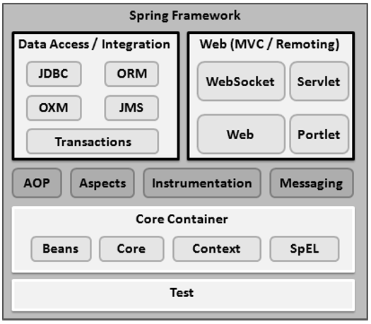
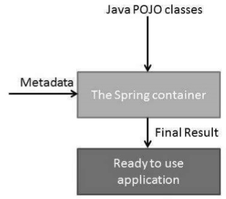

# Spring

## Overview

Spring is the application development framework for developing enterprise applications.

**Spring framework is a alternater for JavaEE (Jakarta EE).**

Spring framework core features: 

- IOC container
- **D**ependency **I**nversion
    The **Inversion of Control (IoC)** is a general concept, and it can be expressed in many different ways. Dependency Injection is merely one concrete example of Inversion of Control.
- **A**spect **O**riented **P**rogramming
    The AOP module of Spring Framework provides an aspect-oriented programming implementation allowing you to define method-interceptors and pointcuts to cleanly decouple code that implements functionality that should be separated.

It enables developers to develop enterprise-class applications **using POJO**.

## Architecture



## IoC Container

The container will *create the objects, wire them together, configure them, and manage their complete life cycle* from creation till destruction.

The Spring container uses DI to manage the components that make up an application.

These objects are called Spring Beans.

The container gets its instructions on what objects to instantiate, configure, and assemble by reading the configuration metadata provided. **The configuration metadata can be represented either by XML, Java annotations, or Java code.**



Spring provides the following two distinct types of containers.

| Container Type                      | Description                                                  | Comment                                                      |
| ----------------------------------- | ------------------------------------------------------------ | ------------------------------------------------------------ |
| Spring BeanFactory Container        | This is the simplest container providing the basic support for DI and is defined by the *org.springframework.beans.factory.BeanFactory* interface. | Used for lightweight applications like mobile devices or applet-based applications |
| Spring ApplicationContext Container | This container adds more enterprise-specific functionality such as the ability to resolve textual messages from a properties file and the ability to publish application events to interested event listeners. This container is defined by the *org.springframework.context.ApplicationContext* interface. | Include all functionality of the BeanFactory container.<br />**Reammend** |

## Bean

### Definition

Bean definition contains the information called **configuration metadata**

- class
- name
- scope
- Construtor-arg
- properties
- Autowiring mode
- Lazy-initialization mode
- initialization method
- Destruction method

Following are the three important methods to provide configuration metadata to the Spring Container −

- XML based configuration file.
- Annotation-based configuration
- Java-based configuration

### Scope

- singleton - This scopes the bean definition to a single instance per Spring IoC container (default). **For stateless Beans.**
- prototype - This scopes a single bean definition to have any number of object instances. **For stateful Beans.**
- request - This scopes a bean definition to an HTTP request. Only valid in the context of a web-aware Spring ApplicationContext.
- session - This scopes a bean definition to an HTTP session. Only valid in the context of a web-aware Spring ApplicationContext.
- global-session - This scopes a bean definition to a global HTTP session. Only valid in the context of a web-aware Spring ApplicationContext.

### Life Cycle

- Init 
- destory
- `BeanPostProcessor` interface

## Dependency Injection

## Auto-Wiring

| Mode        | Description                                                  |
| ----------- | ------------------------------------------------------------ |
| no          | This is default setting which means no autowiring and you should use explicit bean reference for wiring. |
| byName      | Autowiring by property name.                                 |
| byType      | Autowiring by property datatype.                             |
| constructor | Similar to byType, but type applies to constructor arguments. |
| autodetect  | Spring first tries to wire using autowire by *constructor*, if it does not work, Spring tries to autowire by *byType*. |

## Annotation

*Annotation injection is performed before XML injection*. Thus, the latter configuration will override the former for properties wired through both approaches.

| Annotation          | Description                                                  |
| ------------------- | ------------------------------------------------------------ |
| @Required           | applies to bean property setter methods.                     |
| @Autowired          | apply to bean property setter methods, non-setter methods, constructor and properties. |
| @Qualifier          | The @Qualifier annotation along with @Autowired can be used to remove the confusion by specifiying which exact bean will be wired. |
| JSR-250 Annotations | Spring supports JSR-250 based annotations which include @Resource, @PostConstruct and @PreDestroy annotations. |

## Java Based Configuration

### @Configuration & @Bean Annotations

Annotationing a class with the `@Configuration` indicates that the class can be used by the Spring IoC container as a source of bean definitions.

The `@Bean` annotation tells Spring that the method annotated will return an object that should be registered as a bean in the Spring application context.

```java
package com.tutorialspoint;
import org.springframework.context.annotation.*;

@Configuration
public class HelloWorldConfig {
   @Bean 
   public HelloWorld helloWorld(){
      return new HelloWorld();
   }
}

public static void main(String[] args) {
   AnnotationConfigApplicationContext ctx = new AnnotationConfigApplicationContext();

   ctx.register(AppConfig.class, OtherConfig.class);
   ctx.register(AdditionalConfig.class);
   ctx.refresh();

   MyService myService = ctx.getBean(MyService.class);
   myService.doStuff();
}
```

### The @Import Annotation

The **@Import** annotation allows for loading @Bean definitions from another configuration class.

### Lifecycle Callbacks

```java
public class Foo {
   public void init() {
      // initialization logic
   }
   public void cleanup() {
      // destruction logic
   }
}
@Configuration
public class AppConfig {
   @Bean(initMethod = "init", destroyMethod = "cleanup" )
   public Foo foo() {
      return new Foo();
   }
}
```

### Specifying Bean Scope

```java
@Configuration
public class AppConfig {
   @Bean
   @Scope("prototype")
   public Foo foo() {
      return new Foo();
   }
}
```

## Event Handling

## AOP

**A**spect-**O**riented **P**rogramming entails breaking down program logic into distinct parts called so-called concerns. 

There are various common good examples of aspects like logging, auditing, declarative transactions, security, caching, etc.

- Aspect
- Join point
- Advice
- Pointcut
- Introduction
- Target object
- Weaving

## JDBC Framework Overview

Spring JDBC Framework takes care of all the low-level details starting from *opening the connection, prepare and execute the SQL statement, process exceptions, handle transactions and finally close the connection.*

### JdbcTemplate Class

The JDBC Template class executes SQL queries, updates statements, stores procedure calls, performs iteration over ResultSets, and extracts returned parameter values. 

It also catches JDBC exceptions and translates them to the generic, more informative, exception hierarchy defined in the org.springframework.dao package.


## Web MVC Framework

The Spring Web MVC framework provides Model-View-Controller (MVC) architecture and ready components that can be used to develop flexible and loosely coupled web applications. 

### The DispatchrServlet


All the above-mentioned components, i.e. HandlerMapping, Controller, and ViewResolver are parts of *WebApplicationContext* which is an extension of the plain*ApplicationContext* with some extra features necessary for web applications.

```java
@Controller
@RequestMapping("/hello")
public class HelloController { 
   @RequestMapping(method = RequestMethod.GET)
   public String printHello(ModelMap model) {
      model.addAttribute("message", "Hello Spring MVC Framework!");
      return "hello"; // This is a view's name
   }
}
```

The **@Controller** annotation defines the class as a Spring MVC controller.

## Logging with Log4J


## Reference

https://www.tutorialspoint.com/spring/index.htm

