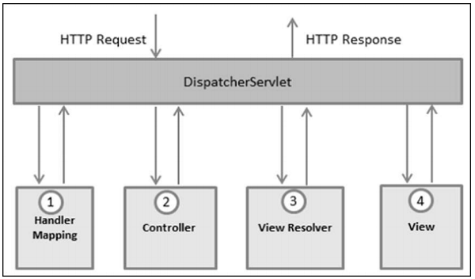

# SpringMVC

## Overview

### What is SpringMVC

Spring MVC framework is an open source Java platform for developing Java based Web Applications.

MVC means Model-View-Controller.

**M**odel - encapsulates the *application data* and they will consist of POJO.

**V**iew - is responsible for *rendering the model data and it generates HTML output*.

**C**ontroller - is responsible for *processing User Requests* and *Building Appropriate Model* and passed it to the *view for rendering*.

### The DispatcherServlet



1. After receiving an HTTP request, DispatchServlet consults the HandlerMapping to call the appropriate Controller.
2. The Controller takes the request and calls the appropriate service methods based on used GET or POST method. The service method will set model data based on defined business logic and returns view name to the DispatcherServlet.
3. The DispatchServlet will take help from ViewResolver to pick up the defined view for the request.
4. Once view is finalized, The DispatchServlet passes the model data to the view, which is finally rendered, on the browses.

### Required Configuration

In the **web.xml file**, url requests should be mapped for handling by the DispatchServelt.

```xml
<web-app id = "WebApp_ID" version = "2.4"
   xmlns = "http://java.sun.com/xml/ns/j2ee" 
   xmlns:xsi = "http://www.w3.org/2001/XMLSchema-instance"
   xsi:schemaLocation = "http://java.sun.com/xml/ns/j2ee 
   http://java.sun.com/xml/ns/j2ee/web-app_2_4.xsd">
 
   <display-name>Spring MVC Application</display-name>

   <servlet>
      <servlet-name>HelloWeb</servlet-name>
      <servlet-class>
         org.springframework.web.servlet.DispatcherServlet
      </servlet-class>
      <load-on-startup>1</load-on-startup>
   </servlet>

   <servlet-mapping>
      <servlet-name>HelloWeb</servlet-name>
      <url-pattern>*.jsp</url-pattern>
   </servlet-mapping>
</web-app>
```

