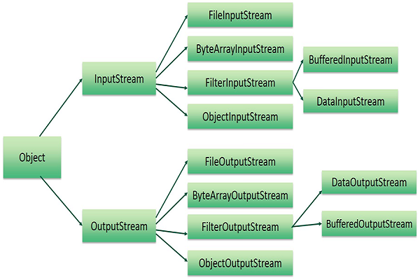
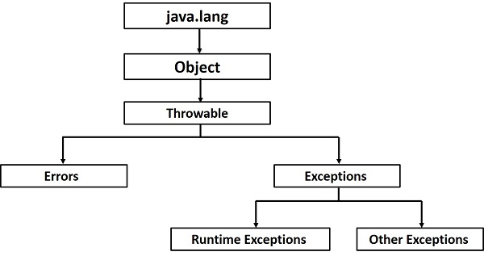
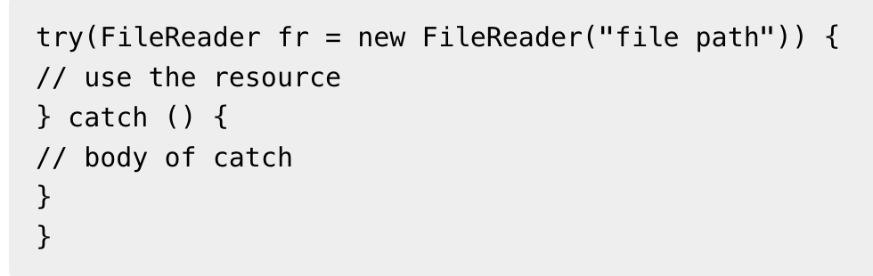
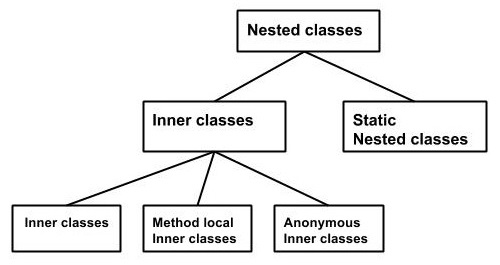

# Java Syntax

## Objects & Classes & Packages
- Objects - Objects have states and behaviors.
- Classes - A class can be defined as a template/blueprint that describes the behavior/state that the object of its type support.

### Class
- A Class can have several variables and methods.
- Types of variable: 
  - Local variables - variables defined inside methods, constructors or blocks are called local variables.
  - Instance variables - Within a class but outside method.
  - Class variables - Within a class, outside method, with the `static` keyword
- Methods:
  - Constructor
    - When a class is initialized the constructor method will be called
    - A class must contain at least one constructor method, if you don't define anyone, the compiler will build a default one.
    - A class can be more than constructor methods, everyone's name must be same as the class name, they could have different parameters.

### Using Class and Object
```java
public class SampleObjectAndClass {
    String name;

    int age;
    public SampleObjectAndClass() {

    }

    public SampleObjectAndClass(String name) {
        this.name = name;
        System.out.println("Input name = " + name);
    }

    public void setAge(int age) {
        this.age = age;
    }

    public int getAge() {
        return age;
    }

    public static void main(String[] args) {
        SampleObjectAndClass obj = new SampleObjectAndClass("object");
        System.out.println(obj.name);
        obj.setAge(22);
        System.out.println(obj.age);
    }
}
```

### Source File Declaration Rules
- There can be only one public class per source file.
- A source file can have multiple non-public class.
- The public class name should be same as the source file name
- If a class is defined inside a package, then the package statement should be the first statement in the source file
- The import statement should be before the class declaration, and behind the package statement if it exists.

### Java Package
- It is a way of categorizing the classes and interfaces.
- Import statement is a way to tell compiler where to find the particular class.

## DataTypes
- There are two data types variable in Java - Primitive Data Types and Reference/Object Data Types
- Primitive Data Types
  - `byte` - 8-bit signed two's complement integer. Default value is 0.
  - `short` - 16-bit signed two's complement integer. Default value is 0.
  - `int` - 32-bit signed two's complement integer. Default value is 0.
  - `long` - 64-bit signed two's complement integer. Default value is 0L.
  - `float` - single-precision 32-bit IEEE 754 floating point. Default value is 0.0f. **Float data type is never used to precise values such as concureecy.**
  - `double` - double-precision 64-bit IEEE 754 floating point. Default value is 0.0d. **Float data type is never used to precise values such as concureecy.**
  - `boolean` - one bit. true or false. Default value is false.
  - `char` - 16-bit Unicode character. 'A'
- Reference Data Types
  - Reference variable are created using defined constructors of the classes.
  - Class objects and various types of array variables come under reference datatype.
  - Default valued of reference datatype is `null`.
  - A reference variable can be used to refer any object of the declared type or any compatible type.

## Variable Types
- Variables are used to reserve memory location to store values.
- Each variable in Java **must have** a specific type.
- You must declare variable before they can be used.
- _Local Variables_ have no default value, so you must give it the default value when declare.
- _Instance Variables_ 
  - are created when an object is created with the use of keywoard `new`, and destroyed when the object is destroyed.
  - have default value
  - can be access directly by calling the variable name inside the class.
- _Class/Static Variables_
  - are declared by using `static` keyword
  - are only one copy for the class, regardless of how many objects are created from it
  - are only be used for declaring constants. 
  - are created when the program starts and destroyed when the program stops.
  - 's names should be upper case when declaring by `public static final`, otherwise are same as instance variables.

## Modifiers
- Access Control Modifiers
  - Visible to the package, the default. No modifiers are needed.
  - Visible to the class only - `private`.
  - Visible to the world - `public`.
  - Visible to the package and subclasses - `protected`.
- Non-Access Modifiers
  - `static` - creating class methods and variables.
  - `finale` - finalizing the class, methods and variables.
  - `abstract` - creating abstract classes and methods.
  - `syncronized` and `volatile` - using for threads.

## Basic Operators
- Arithmetic Operators: + - * / % ++ --
- Relational Operators: == != > < >= <=
- Bitwise Operators: & | ^ ~ << >> >>>
- Logical Operators: && || !
- Assignment Operators: = >= <= <<= >>= += -= *= /= ^= &= |= %=

## Loop Control
- while loop, for loop, do...while loop
- break, continue

## Decision Making Statement
- if, if else, switch
- ?:

## Wrapper Class
- Number -> Byte, Integer, Float, Double, Short, Long
- Character

## Strings
- The String class is immutable, you can use `String Buffer` or `String Builder` to get a string can be changed.

## Arrays
- Array stores **fixed-size** sequential collection of elements of **same type**.
- Create an array:
`dataType[] arrayRefVar = new dataType[arraySize];`
`dataType[] arrayRefVar = {value0, value1, ..., valuek};`
- Static Methods: `binarySearch` `equals` `fill` `sort`

## Date and Time
- In `java.util` package
- Initialization, Comparison, Format, Calendar

## Regular Expression
- The main classes: 
  - `Pattern` - a compiled representation of a regular expression. No public constructor, call static `compile()` method to create instance.
  - `Matcher` - an engine that interprets the pattern and perform match operations against an input string.
    No public constructor. You obtain a Matcher object by invoking `matcher()` method on a Pattern object. 
  - `PatternSyntaxException` - an unchecked exception that indicates syntax error in a regular expression pattern.
- Capture Groups
  - a way to treat multiple characters as a single unit.
  - to find out how many groups are present in the expression, call the `groupCount` method on a matcher object.

## Methods
```java
public static int methodName(int a, int b) {
// body
}
```
- When `void` as return type, you can don't return value.
- Parameters can be passed by value or by reference.
- Overloading - Two or more methods in a class have same names and different parameters (the return type can be same)
- `this` keyword - a reference to the object of the current class, w**ithin an instance method or a constructor.**
- Variable Arguments (var-args)
  - `typeName... parameterName`
  - Only one variable argument may be specified in a method
  - The variable parameter must be the last parameter
- `finalize()` methods - will be called before an object's final destruction by the garbage collector.
  - You can not know when or if the finalize method will be executed.
  - _deprecated from Java 9_

## File and I/O

### Stream
- InPutStream - used to read data from a source
- OutPutStream - used for writing data to a destination
- Byte Stream - are used to perform input and output of 8-bit byte. Relative classes: `FileInputStream` `FileOutputStream`
- Character Stream - are used to perform input and output of 16-bit byte. Relative classes: `FileRead` `FileWrite`
  - `FileRead` and `FileWrite` just use `FileInputStream` and `FileOutputStream`, but they read or write 2 bytes at a time.
- Standard Stream - `System.in`, `System.out`, `System.err`
- File Stream - `FileInputStream`, `FileOutputStream`

## Exceptions
- The types of Exceptions
  - Checked Exceptions (Compile time exceptions) - checked by compiler at compile-time
  - Unchecked Exception (Runtime Exceptions)
  - Errors - are typically ignored in your code
- Exception Hierarchy
  
  - Errors - Example JVM out of memory
- Catching Exceptions

```java
try {
// Protected code
} catch (ExceptionType1 e1) {
// Catch block
} catch (ExceptionType2 e2) {
// Catch block
} catch (ExceptionType3 e3) {
// Catch block
} finally {
    // The finally block always executes.
}
```

```java
public void deposit(double amount) throws RemoteException {
    // Method implementation
    throw new RemoteException();
}
```

- try-with-resource - automatically closes the resources used within the try catch block.

  - To use a class with try-with-resources statement it should implement AutoCloseable interface and the close() method of it gets invoked automatically at runtime.
  - You can declare more than one class in try-with-resources statement.
  - While you declare multiple classes in the try block of try-with-resources statement these classes are closed in reverse order.
  - Except the declaration of resources within the parenthesis everything is the same as normal try/catch block of a try block.
  - The resource declared in try gets instantiated just before the start of the try-block.
  - The resource declared at the try block is implicitly declared as final.
- User-define Exception
  - All exceptions must be a child of Throwable.
  - If you want to write a checked exception that is automatically enforced by the Handle or Declare Rule, you need to extend the Exception class.
  - If you want to write a runtime exception, you need to extend the RuntimeException class.
- Common Exceptions
  - JVM Exceptions − These are exceptions/errors that are exclusively or logically thrown by the JVM. Examples: NullPointerException, ArrayIndexOutOfBoundsException, ClassCastException.
  - Programmatic Exceptions − These exceptions are thrown explicitly by the application or the API programmers. Examples: IllegalArgumentException, IllegalStateException.

## Inner Classes

- The class written within is called the nested class, and the class that holds the inner class is called the outer class.
- Inner classes - declare a class inside other class, the inner class can be private
- Method local Inner classes - declare a class inside method
- Anonymous Inner classes - declare class inside method without class name, it must be subclass of other class or an interface
  - Anonymous Inner class can be used as a parameter
- Static Nested classes - declare a class inside another class with `static` modifier