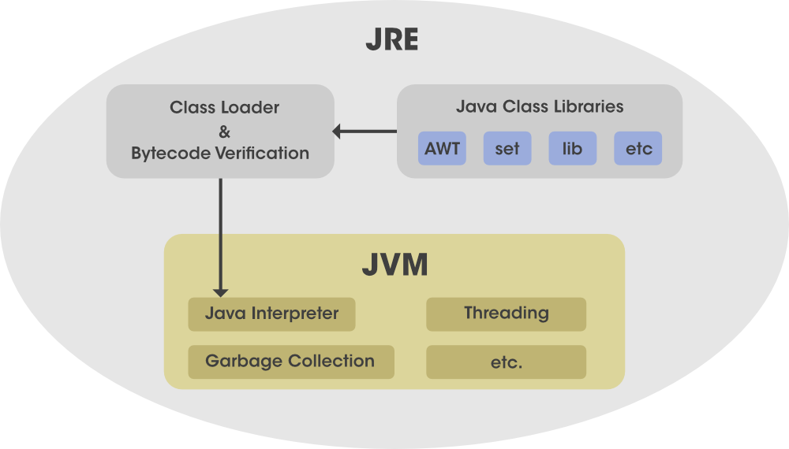
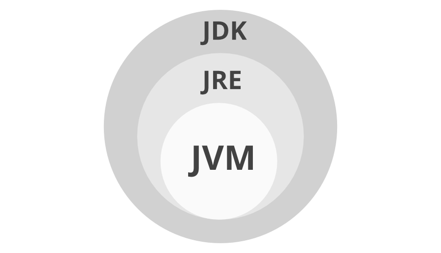

# JRE

## Overview

**Java Runtime Environment (JRE) is an open-access software distribution with a Java class library, specific tools, and a separate JVM.**

 JRE is one of the interrelated components in the Java Development Kit (JDK). 

It is the most common environment available on devices for running Java programs.

 Java source code is compiled and converted to Java bytecode. **If you want to run this bytecode on any platform, you need JRE.** 

The JRE loads classes, check memory access and get system resources.

 **JRE acts as a software layer on top of the operating system.**

JRE is the implementation of JVM (Java Virtual Machine), and it is specially designed to **provide an environment to *execute* Java programs.**

**JRE is also platform dependent like JDK.**

It doesn’t contain any development tools like a compiler, debugger, etc.

*If we only want to execute a program, we just need to install JRE and not JDK.*

### Components of JRE

- Integration libraries include Java Database Connectivity (JDBC)
- Java Naming, Interface Definition Language (IDL)
- Directory Interface (JNDI)
- Remote Method Invocation Over Internet Inter-Orb Protocol (RMI-IIOP)
- Remote Method Invocation (RMI)
- Scripting

- JVM
- User Interface Library: Swing, Java 2D, AWT, Accessibility, Image I/O, Print Service, Sound, drag and drop, and input methods.
- Lang and util base library: lang and util, zip, Collections, Concurrency, Utilities, management, Java Archive (JAR), instrument, reflection, versioning, Preferences API, Ref Objects, Logging, and Regular Expression.
- Other base libraries: JMX, JNI, Math, Networking, international support, I/O, Beans, Java override Mechanism, Security, Serialization, JAXP.
- Deployment technologies: Java Web Start, deployment, and Java plug-in.

## Working of JRE

***Java Development Kit (JDK) and Java Runtime Environment (JRE)  both interact with each other to create a sustainable runtime environment that enables Java-based applications to run seamlessly on any operating system.***

**The JRE runtime architecture consists of the following elements as listed:**

- **ClassLoader**: Java ClassLoader dynamically loads all the classes necessary to run a Java program. Because classes are only loaded into memory whenever they are needed, the JRE uses ClassLoader will automate this process when needed.  
- **Bytecode Verifier**: The bytecode checker ensures the format and precision of Java code before passing it to the interpreter. If the code violates system integrity or access rights, the class is considered corrupt and will not load.  
- **Interpreter**: After loading the byte code successfully, the Java interpreter *creates an object of the Java virtual machine* that allows the Java program to run natively on the underlying machine.

**JRE Workflow**

1. Compile: compile `.java` to `.class`
2. Runtime: ClassLoader -> Byte Code Verifier -> Interpreter (Execute the Byte Code, Make appropriate calls to the underlying hardware)

## How does JVM work?

**JVM becomes an instance of JRE at the runtime of a Java program.** 

It is widely known as a runtime interpreter.

**Mainly responsible for three activities:**

- Loading
- Linking
- Initialization

## Reference

https://www.geeksforgeeks.org/jre-in-java/

https://www.geeksforgeeks.org/difference-between-jdk-and-jre-in-java/?ref=rp

