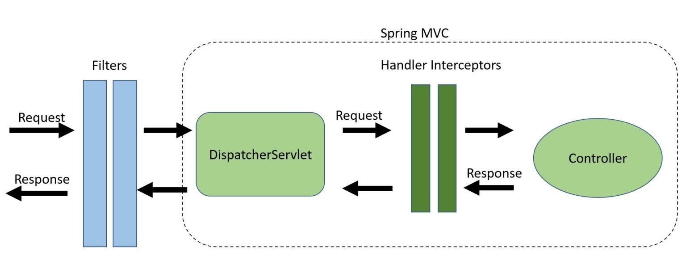

# Spring Boot

> On Mac with homebrew, maven

## Overview

### What is Spring Boot?

Spring Boot provides a good platform for Java developers to develop a **stand-alone** and **production-grade** spring application that you can **just run**. You can get started with **minimum configurations** without the need for an entire Spring configuration setup.

### Advantages

- Easy to understand and develop spring applications
- Increases productivity
- Reduces the development time

- Everything is auto configured, no manual configurations are needed.
- Offers annotation-based spring application
- Eases dependency management
- Includes Embedded Servlet Container

### How does it work?

- Spring Boot automatically configures your application **based on the dependencies** you have added to the project by using *@EnableAutoConfiguration* annotation.
- The entry point of the spring boot application is the class contains **@SpringBootApplication** annotation and the main method.
- Spring Boot automatically scans all the components included in the project by using **@ComponentScan** annotation.

### Spring Boot Starters

- `spring-boot-starter-actuator`
- `spring-boot-starter-security`

## Runner

### Application Runner

```java
@SpringBootApplication
public class DemoApplication implements ApplicationRunner {
   public static void main(String[] args) {
      SpringApplication.run(DemoApplication.class, args);
   }
   @Override
   public void run(ApplicationArguments arg0) throws Exception {
      System.out.println("Hello World from Application Runner");
   }
}
```

### Command Line Runner

```java
@SpringBootApplication
public class DemoApplication implements CommandLineRunner {
   public static void main(String[] args) {
      SpringApplication.run(DemoApplication.class, args);
   }
   @Override
   public void run(String... arg0) throws Exception {
      System.out.println("Hello world from Command Line Runner");
   }
}
```

## Application Properties

### Command Line Properties

- Startup Application: `java -jar xxx.jar --server.port=9090``

### `application.properties` file

```text
server.port = 9090
spring.application.name = demoservice
```

### YAML file

```yaml
spring:
	application:
		name: demoservice
	server:
		port: 9090
```

### specify external file as property file
`-Dspring.config.location = C:\application.properties`

### Use of @Value Annotation

The @Value annotation is used to **read the environment or application property value** in Java code.

`@Value("${spring.application.name:defalut_name}")`

### Spring Boot Active Profile

#### Spring active profile in application.properties

**application.properties**

```properties
server.port = 8080
spring.application.name = demoservice
```

**application-dev.properties**

```properties
server.port = 9090
spring.application.name = demoservice
```

**application-prod.properties**

```properties
server.port = 4431
spring.application.name = demoservice
```

The command to set the spring active profile is shown below - 

`java -jar xxx.jar --spring.profiles.active=dev/prod`

#### Spring active profile for application.yml

```yml
spring:
   application:
      name: demoservice
server:
   port: 8080

---
spring:
   profiles: dev
   application:
      name: demoservice
server:
   port: 9090

---
spring: 
   profiles: prod
   application:
      name: demoservice
server: 
   port: 4431
```

## Installation

- Install maven: `brew install maven`

- Get spring-starter-web template: start.spring.io

- Change xxxApplication.java file:

    ```java
    @RestController
    @SpringBootApplication
    public class WebDemoApplication {
    	@RequestMapping("/")
    	String home() {
    		return "Hello World!";
    	}
    
    	public static void main(String[] args) {
    		SpringApplication.run(WebDemoApplication.class, args);
    	}
    }
    ```
    
- Start up spring boot project with maven: `mvn spring-boot:run` 

    - Set os env: *export MAVEN_OPTS=-Xmx1024m* 

- Start up spring boot project with gradle: `gradle bootRun` 

    - Set os env:  *export *JAVA*_OPTS=-Xmx1024m* 

## Spring Boot Application Execution Process

## Deploy

### Deploy Spring Boot App without Embedded Server

- **Install Java**
- **Download and Set up Web Server (tomcat)**
- **Package App as War file**
    - Selecting *War Packaging* when create Spring Boot Project
    - Run as *Maven Build*, Goal as *clean install*
    - When complete, refresh the project directory
- **Deploy a Web Server (tomcat)**
    - Copy "xxx.war" file to tomcat/webapps directory
    - `cd bin/`
    - `chmod +x catalina.sh`
    - startup: `sh startup.sh`
    - Shutdown: `sh shutdown.sh

## Logging

**Spring Boot uses Apache Commons logging for all internal logging.**

## Building RESTful Web Services

- For building a RESTful Web Services, we need to add the Spring Boot Starter Web dependency into the build configuration file.

### Rest Controller

```java
@RestController
public class ProductServiceController {}
```

### Request Mapping

```java
@RequestMapping("/products")
public ResponseEntiry<Object> getProducts() {}
```

### Request Parameter

```java
public ResopnseEntity<Object> getProduct(
	@RequestParam(value = "name", request = false, defaultValue = "honey") String name) {}
}
```

## Exception Handling

### Controller Advice

The `@ControllerAdvice` is a annotation, to handle the exceptions globally.

### Exception Handler

The `@ExceptionHandler` is an annotation used to handle the specific exceptions and sending the custom responses to the client.

### NotFoundException class

```java
public class ProductNotFoundException extends RuntimeException {
	private static final long serialVersionUID = 1L;
}
```

### NotFoundExceptionController class

```java
@ControllerAdvice
public class ProductExceptionController {
	@ExceptionHandler(value = ProductNotFoundException.class)
	public ResponseEntity<Object> exception(ProductNotFoundException exception) {
	      return new ResponseEntity<>("Product not found", HttpStatus.NOT_FOUND);
	}
}
```

### throw exception in service controller

```java
@RequestMapping(value = "/products/{id}", method = RequestMethod.PUT)
public ResponseEntity<Object> changeProduct(@PathVariable("id") long id) {
	throw new ProductNotFoundException();
}
```

## Spring Interceptor

### Using scenarios

- Before sending the request to the controller
- Before sending the response to the client

### HandlerInterceptor interface

To work with interceptor, you need to create `@Component` class that suports it and it should implement the `HandleIntercetor` interface.

- `preHandle()` method - Executed before the target handler is called.
- `postHandle()` method - Executed after the target handler bug before the DispatchServlet renders the view
- `afterCompletion()` method - Callback after completion of request processing and view rendering

### WebMvcConfigurer interface

```java
@Component
public class ProductServiceInterceptorAppConfig implements WebMvcConfigurer {
	@Autowired
	ProductServiceInterceptor productServiceInterceptor;

	@Override
	public void addInterceptors(InterceptorRegistry registry) {
		registry.addInterceptor(productServiceInterceptor);
	}
}
```

## Servlet Filter

```java
@Component
public class SimpleFilter implements Filter {
   @Override
   public void destroy() {}

   @Override
   public void doFilter
      (ServletRequest request, ServletResponse response, FilterChain filterchain) 
      throws IOException, ServletException {}

   @Override
   public void init(FilterConfig filterconfig) throws ServletException {}
}
```

### Filter vs Interceptor



- Filter is related to the Servlet API, HandlerInterceptor is a Spring specific concept.
- A HandlerInterceptor is used for fine-grained handler-related preprocessing tasks, is ideal for more fine-grained tasks:
    - authorization checks
    - locale or theme changes
- Filters are more powerful, is well-suited for request content and view content handling, are ideal for coarse-grained tasks:
    - Authentication
    - Logging and auditing
    - Image and data compression
    - Any functionality we want to be decoupled from Spring MVC
- Filter can get configured in web.xml, HandlerInterceptor only can be configured in the application context.
- HandlerInterceptor can access to the Handler and ModelAndVeiw objects.
- `Filter.onFilter()` is executed before request reach the DispatchServlet, `Interceptor.preHandler()`  execute between the DispatchServlet and Controller.

## Tomcat Port Number

In the application properties file: `server.port = 9090`

Random Port: `server.port = 0`

## Service Components

Service Component are the class file which contains `@Service` annotation.

These class files are used to write business logic in a different layer, separete from `@RestController` class file.

```java
public interface ProductService {
    public abstract void createProduct(Product product);
   	public abstract void updateProduct(String id, Product product);
   	public abstract void deleteProduct(String id);
   	public abstract Collection<Product> getProducts();
}
```

The class implements the Interface with `@Service` annotation is as shown

```java
@Service
public class ProductServiceImpl implements ProductService {
    
}
```

The code here show the Rest Controller class file

```java
@RestController
public class ProductServiceController {
    @Autowired
    ProductService productService;
}
```

## Thymeleaf

Thymeleaf is a Java-based library used to create a web application.

It provides a good support for serving a HTML5 in web applications.

## CORS Support

### Enable CORS in Controller Method

```java
@RequestMapping(value = "/products")
@CrossOrigin(origins = "http://localhost:8080")
public ResponseEntity<Object> getProduct() {
    return null;
}
```

### Global CORS Configuration

```java
@SpringBootApplication
public class DemoApplication {
    ....
    @Bean
    public WebMvcConfigurer corsConfigurer() {
        return new WebMvcConfigurerAdapter() {
            @Override
            public void addCorsMappings(CorsRegistry registry) {
                registry.addMapping("/products").allowdOrigins("http://localhost:8080");
            }
        }
    }
}
```

## Scheduling

Add `@EnableScheduling` annotation to the main Spring Boot application class file.

```java
@SpringBootApplication
@EnableScheduling
public class DemoApplication {
    public static void main(String[] args) {
        SpringApplication.run(DemoApplication.class, args)
    }
}
```

### Trigger the scheduler for a specific time period

```java
@Component
public class Sheduler {
    // execute the task every minute starting at 9:00 AM and ending at 9:50 AM
	@Scheduled(cron = "0 * 9 * * ?")
	public void cronJobSch() throws Exception {}
}
```

### Fixed Rate

```java
// Execute a task on every second from the application startup
@Sceduled(fixedRate = 1000)
public void fixedRateSch() {}
```

### Fixed Delay

```java
// Execute a task every second after 3 seconds from the application startup
@Scheduled(fixedDelay = 1000, initialDelay = 3000)
public void fixedDelaySch() {}
```

## Enabling HTTPS

Follow the steps given below to configure the HTTPS and the port 443 in Spring Boot application

- Obtain the SSL certificate - Create a self-signed certificate or get on from a Certificate Authority
- Enable HTTPS and 443 port

### Self-Signed Certificate

```
keytool -genkey -alias tomcat -storetype PKCS12 -keyalg RSA -keysize 2048 -keystore keystore.p12 -validity 3650
```

### Configure HTTPS

Add some configurations in *application.properties* file:

```properties
server.port: 443
server.ssl.key-store: keystore.p12
server.ssl.key-store-password: springboot
server.ssl.keyStoreType: PKCS12
server.ssl.keyAlias: tomcat
```

> The certificate should be placed at the root directory of current project

## Unit Test

### Mockito

Mockito is a library for mock unit test.

#### Add dependency

```xml
<dependency>
   <groupId>org.mockito</groupId>
   <artifactId>mockito-core</artifactId>
   <version>2.13.0</version>
</dependency>
<dependency>
   <groupId>org.springframework.boot</groupId>
   <artifactId>spring-boot-starter-test</artifactId>
   <scope>test</scope>
</dependency>
```

## Database Handling

### Add jdbc dependency

```xml
<dependency>
   <groupId>org.springframework.boot</groupId>
   <artifactId>spring-boot-starter-jdbc</artifactId>
</dependency>
```

### Connect MySQL

```xml
<dependency>
   <groupId>mysql</groupId>
   <artifactId>mysql-connector-java</artifactId>
</dependency>
```

`application.properties` file

```properties
spring.datasource.driverClassName = com.mysql.jdbc.Driver
spring.datasource.url = jdbc:mysql://localhost:3306/PRODUCTSERVICE?autoreconnect = true
spring.datasource.username = root
spring.datasource.password = root
spring.datasource.testOnBorrow = true
spring.datasource.testWhileIdle = true
spring.datasource.timeBetweenEvictionRunsMillis = 60000
spring.datasource.minEvictableIdleTimeMillis = 30000
spring.datasource.validationQuery = SELECT 1
spring.datasource.max-active = 15
spring.datasource.max-idle = 10
spring.datasource.max-wait = 8000
```

### Connect Redis

```xml
<dependency>
   <groupId>org.springframework.boot</groupId>
   <artifactId>spring-boot-starter-redis</artifactId>
</dependency>
```

Use RedisTemplate to connect Redis:

```java
@Bean
JedisConnectionFactory jedisConnectionFactory() {
   JedisConnectionFactory jedisConFactory = new JedisConnectionFactory();
   jedisConFactory.setHostName("localhost");
   jedisConFactory.setPort(6000);
   jedisConFactory.setUsePool(true);
   return jedisConFactory;
}
@Bean
public RedisTemplate<String, Object> redisTemplate() {
   RedisTemplate<String, Object> template = new RedisTemplate<>();
   template.setConnectionFactory(jedisConnectionFactory());
   template.setKeySerializer(new StringRedisSerializer());
   template.setHashKeySerializer(new StringRedisSerializer());
   template.setHashValueSerializer(new StringRedisSerializer());
   template.setValueSerializer(new StringRedisSerializer());
   return template;
}
```

Access Redis database

```java
@Autowired

RedisTemplate<String, Object> redis;
Map<Object,Object> datalist = redis.opsForHash().entries(“Redis_code_index_key”);
```

## Securing Web Applications

If a Spring Boot Security dependency is added on the classpath, Spring Boot application **automatically requires** the Basic Authentication for all HTTP Endpoints.

Add dependency

```xml
<dependency>
   <groupId>org.springframework.boot</groupId>
   <artifactId>spring-boot-starter-security</artifactId>
</dependency>
```


## Reference

https://www.tutorialspoint.com/spring_boot/index.htm
