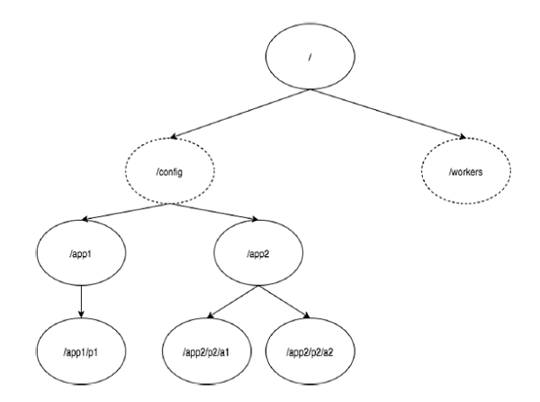
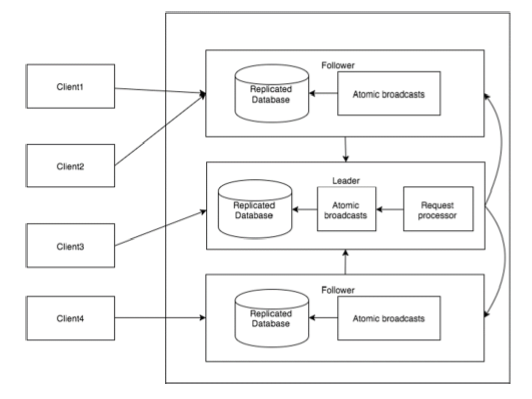

# Zookeeper

## Overview

ZooKeeper is a distributed co-ordination service to manage large set of hosts.

### Distributed Application

A group of systems in which a distributed application is running is called a **Cluster**.

Each machine running in a cluster is called a **Node**.

### The common services provided by ZooKeeper:

- **Naming service** - similar to DNS, but for nodes
- **Configuration management** 
- **Cluster management** - Joining / leaving of a node in a cluster and node status at a real time.
- **Leader election**
- **Locking and synchoronization service**
- **Highly reliable data registry**

### Benefits of ZooKeeper

- Simple distributied coordination process
- Synchronization
- Ordered Messages
- Serialization
- Reliability
- Atomicity

## Architecher of ZooKeeper

| Part     | Description                                                  |
| -------- | ------------------------------------------------------------ |
| Client   | Clients, one of the nodes in our distributed application cluster, access information from the server. |
| Server   | One of the nodes in our ZooKeeper ensemble, provides all the services to clients. |
| Ensemble | Group of ZooKeeper servers. The minimum number of nodes that is required to form an ensemble is 3. The number of servers should be 3, 5, or 7. |
| Leader   | Server node which performs automatic recovery if any of the connected node failed. Leaders are elected on serveice startup. |
| Follower | Server node which follows leader instruction.                |

### Hierarchical Namespace

- "/" is root znode
- The config namespace is used for centralized configuration management
- The worker namespace is used for naming.

Every znode in the ZooKeeper data model maintains a **stat** structure.

- **Version number**
- **Action Control List (ACL)**
- **Timestamp**
- **Data length. - You can store a maximum of 1MB of data.**

### Types of Znodes

- **Persistence znode** - Persistence znode is alive even after the client which created that particular znode is disconnected. (default)
- **Ephemeral znode** - Ephemeral znodes are active until the client is alive. Ephemeral znodes play an important role in Leader election.
- **Sequential znode** - Sequential znodes can be either persistent or ephemeral. Sequential znodes play an important role in Locking and Synchronization.

### Session

Once a client connects to a server, the session will be established and a session id is assigned to the client.

Requests in a session are executed in FIFO order.

The client sends heartbeats at a particular time interval to keep the session valid.

If the ZooKeeper ensemble does not receive heartbeats from a client for more than the period (session timeout) specified at the starting of the service, it decides that the client died.

### Watches

Wathes are a simple mechanism for the client to get notifications about the changes in the ZooKeeper ensemble.

Clients can set watches while reading a particular znode.

Watches send a notification to the registered client for any of the znode changes.

Znode changes are modification of data associated with the znode or changes in the znode's children.

## Workflow

| Component           | Description                                                  |
| ------------------- | ------------------------------------------------------------ |
| Write               | Write process is handled by the leader node. The leader forward the write requests to all the znodes and waits for answers from the znodes. **If half of the znodes reply, then the write process is complete.** |
| Read                | Reads are performed internally by a specific connected znode, so there is no need to interact with the cluster. |
| Replicated Database | It is used to store data in zookeeper. **Each znode has its own database** and every znode has the same data at every time with the help of consistency. |
| Leader              | Leader is the Znode that is responsible for processing write requests. |
| Follower            | Followers receive write requests from the clients and forward them to the leader znode. |
| Request Processor   | Present only in leader node. It governs write requests from the follower node. |
| Atomic broadcasts   | Responsible for broadcasting the changes from the leader node to the follower nodes. |

## Leader Election

## Reference

[Zookeeper tutorial in tutorialspoint](https://www.tutorialspoint.com/zookeeper/index.htm)
